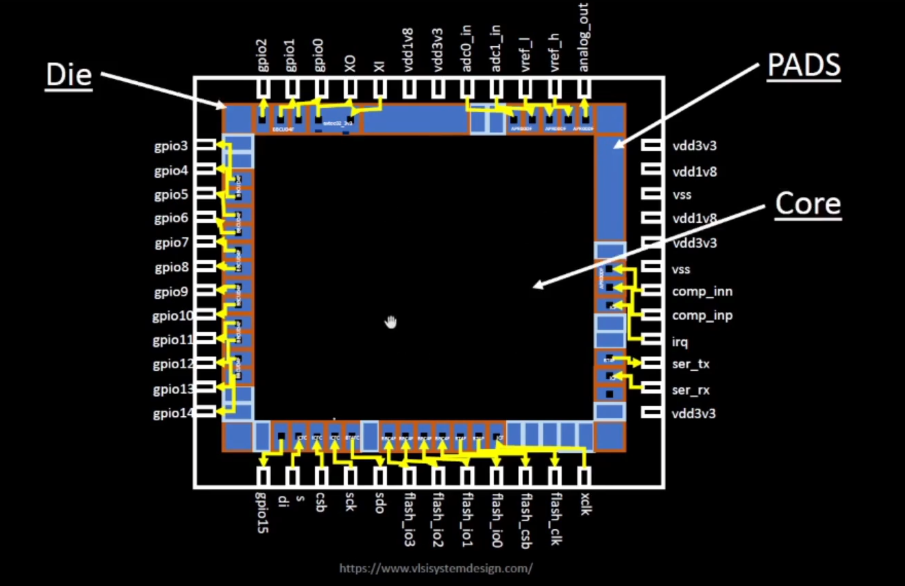
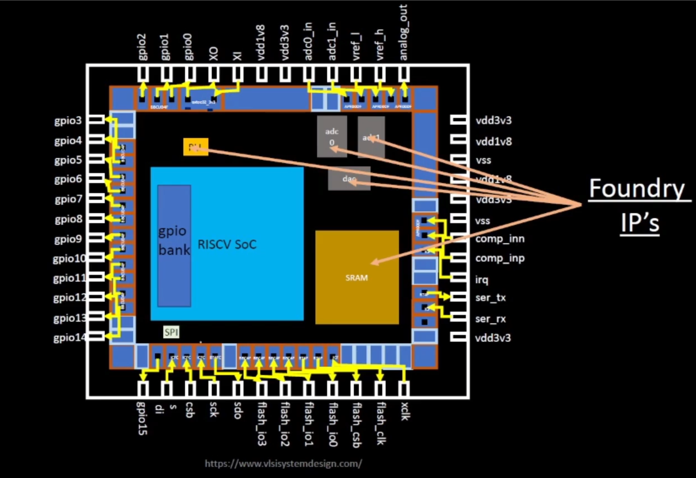
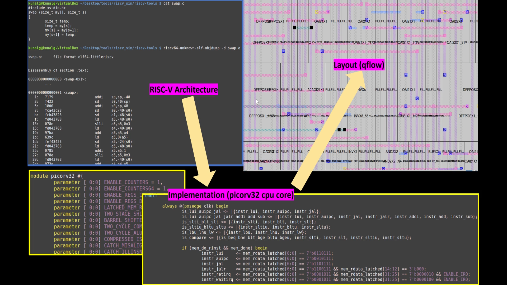
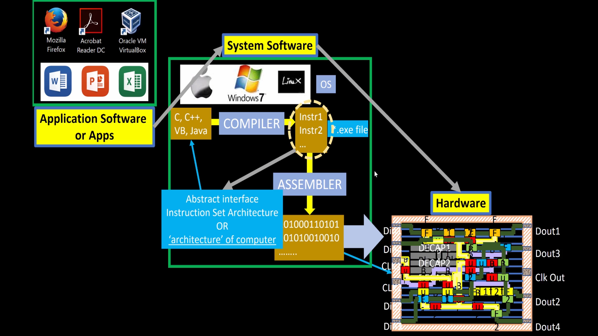
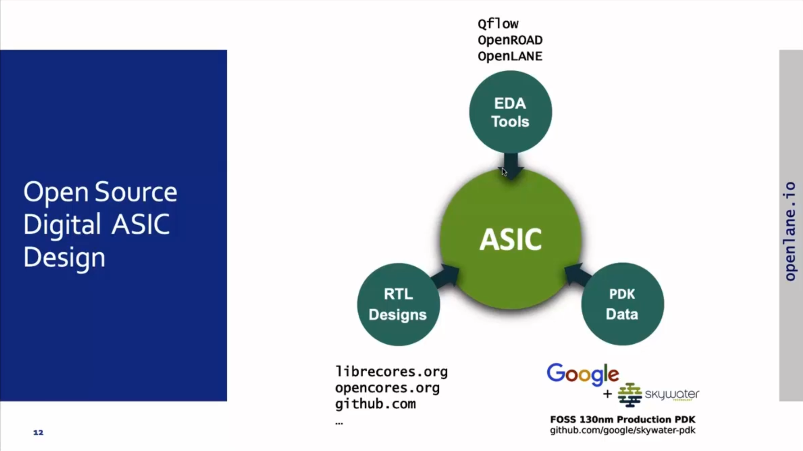
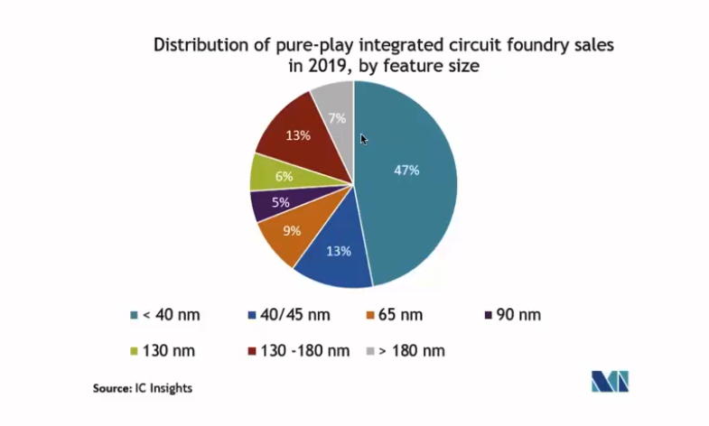
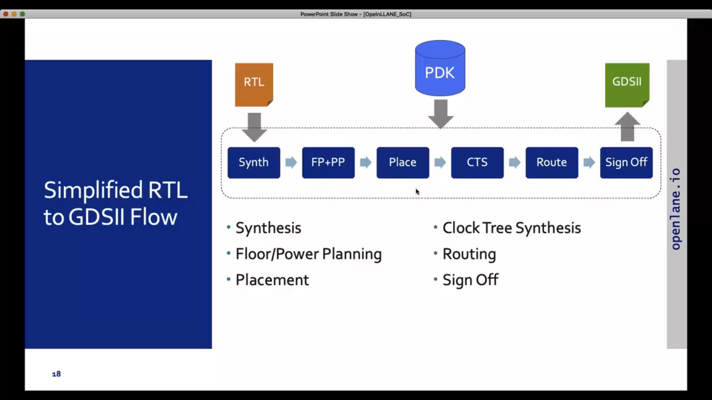

# Sky130 Day 1 - Inception of open-source EDA, OpenLANE and Sky130 PDK

## SKY130_D1_SK1 - How to talk to computers

### SKY_L1 - Introduction to QFN-48 Package, chip, pads, core, die and IPs

- A typical package looks like:
 

- Typical components of the core are:
 

### SKY_L2 - Introduction to RISC-V

1. A-C program running on a machine(layout/hardware) Follows the following steps of execution.
   - C program --- Assembly language --- Machine Language(binary logic) --- Layout --- output
2. Another interface existing between the RISC-V and layout is the HDL.
   

### SKY_L3 - From Software Applications to Hardware

 

## SKY130_D1_SK2 - SoC design and OpenLANE

### SKY_L1 - Introduction to all components of open-source digital asic design

The open source ASIC design comprises of:

 

Market share of the 130nm technology:

 

 Is 130nm fast?
  -  Intel P-4EE reported to 327MHz post-layout clock  for a single cycle RV32i and >1GHz for pipelined version

A simplified RTL design flow can be shown as:

  

